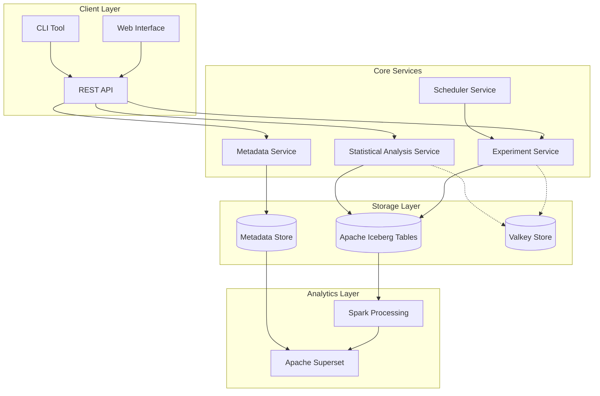

# Experimentation Platform

This is a new free, open source experimentation platform. The purpose is to provide a simple, easy to use, and extensible platform that makes experimentation easy for everyone.

> NOTE: This is mainly a side, personal project of mine. I am building this to learn more about the technologies, however, I do want it to be useful for others. Initially, this will be super basic and not very well put together. I will be building it over time.

## Architecture

At the time of writing, I'm still in the early stages of designing this system, however, I do think it will look a little something like this:

- Client layer will be the main interface for users to interact with the platform. It will include a CLI for other systems, a web interface for viewing and interacting with experiments, and a REST API to connect data to these services.

- Core Services will be a set of services that are responsible for completing the actions of the platform.
   - Metadata Service will handle experiment configuration, versioning and tracking.
   - Statistical Analysis Service will perform computations and hypothesis testing on the data.
   - Experiment Service will manage the experiment lifeycle.
   - Scheduler Service will schedule experiments to be run when chosen and to perform automated analysis.

- The Storage Layer will consist of three main components:
   - Apache Iceberg Tables will be used to store the data for the results of experiments.
   - Metadata Store will be used to store metadata about experiments, users, and other entities.
   - Valkey Store will be used to cache frequently accessed data.

- The Analytics Layer will consist of two main components:
   - Apache Superset will be used to visualize the data.
   - Spark Processing will be used to perform the computations and hypothesis testing.

(I may also extend this with Apache Flink later on but I've not gone too deep into it yet).